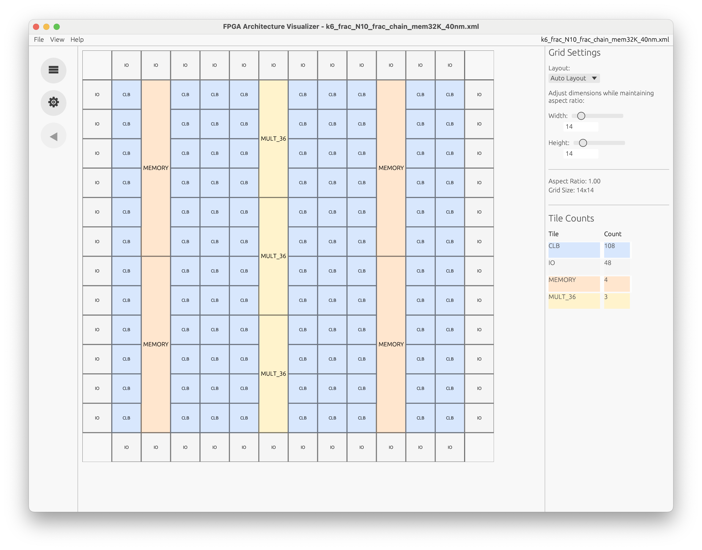
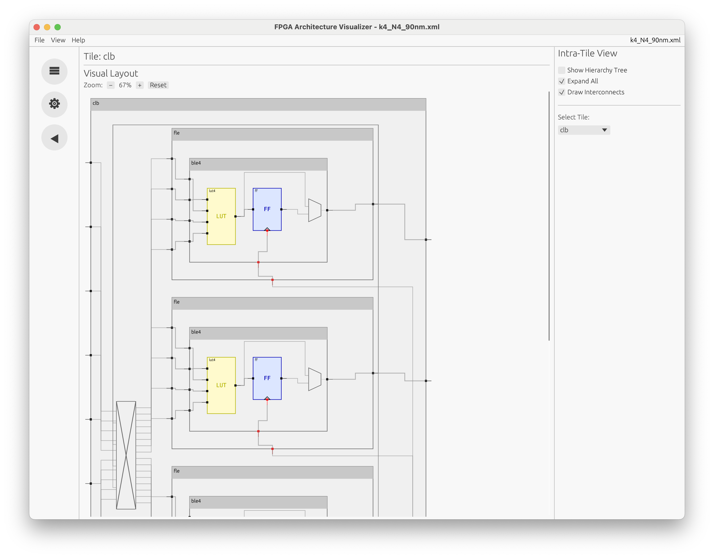
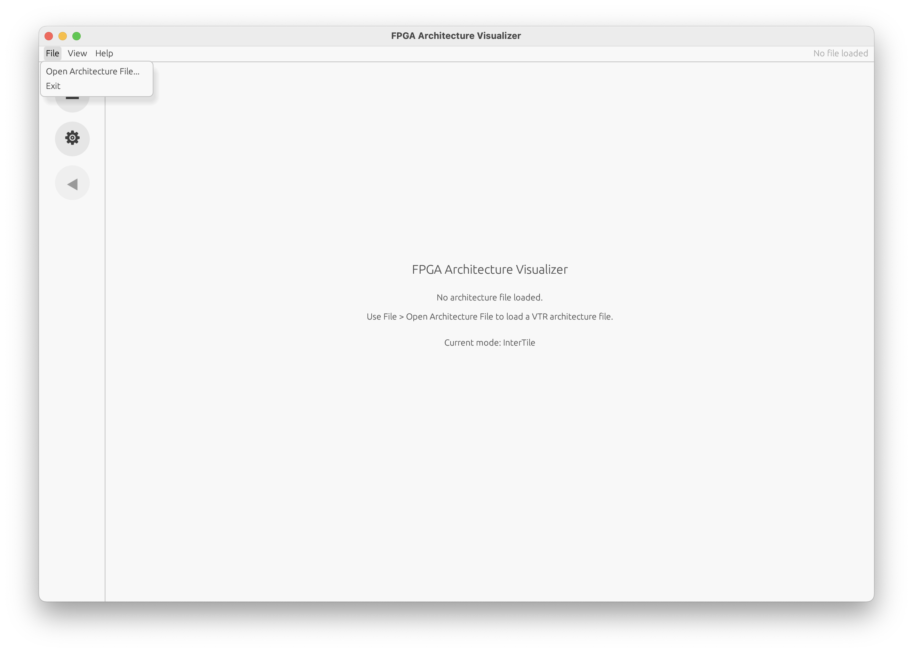
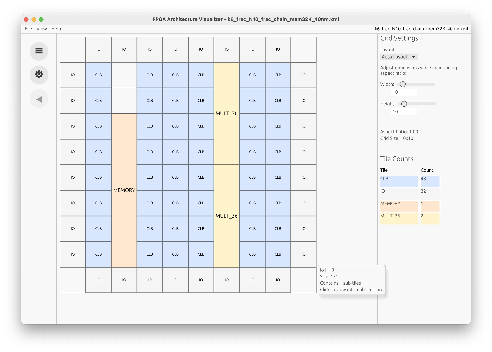
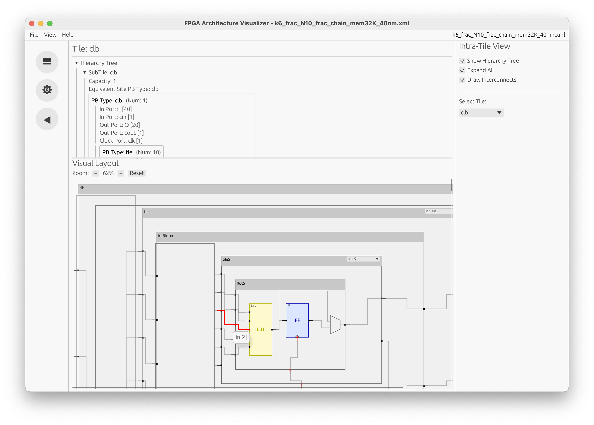

# rust-fpga-arch-visualizer

<p>


</p>

## Install

### Pre-Built Binaries

#### macOS and Linux (not NixOS):

Run the following code in a terminal:
```sh
curl --proto '=https' --tlsv1.2 -LsSf https://github.com/AlexandreSinger/rust-fpga-arch-visualizer/releases/latest/download/fpga_arch_viewer-installer.sh | sh
```

#### Windows PowerShell:

Run the following code in PowerShell:
```sh
powershell -ExecutionPolicy Bypass -c "irm https://github.com/AlexandreSinger/rust-fpga-arch-visualizer/releases/latest/download/fpga_arch_viewer-installer.ps1 | iex"
```

### Build From Source

This project uses `cargo` as a build system. You will need to install `cargo` to
build this project from source.

Download the code for this repository and navigate into it. Then run the following
commands:
```sh
cargo build --release

./target/release/fpga_arch_viewer
```

## Motivation

Computer Aided Design (CAD) software has been mostly dominated by C++ due to its high performance and prior adoption. Due to this decision, many of these tools suffer from poor memory safety, brought on by how pointers are used within the C++ language, especially in parsing code which reads custom files written by users. This has led to open-source CAD software that is prone to crashes, making the tools challenging to use, which is especially a concern for commercial applications.

The open-source [Verilog to Routing](https://verilogtorouting.org/) (VTR) project is a collection of CAD tools used for researching and designing Field-Programmable Gate Arrays (FPGAs). It is a popular infrastructure used for implementing a circuit (written in Verilog) onto a general class of FPGAs. To allow VTR to target many different FPGAs, VTR allows the user to describe their FPGA architecture through an XML-based Architecture Description File. This file is used by many commercial companies who use VTR’s architecture description file to represent their bespoke FPGA architectures. VTR is also used to explore new and exciting FPGA architectures, which may not have been physically implemented in silicon yet.

One major challenge faced by architecture designers who use VTR is how to efficiently write and debug their architecture description files. Although VTR provides a visualizer as part of the Versatile Place and Route (VPR) tool, the placer and router for the CAD flow, this visualizer was designed specifically for visualizing FPGA CAD algorithms and not for developing FPGA architectures. This visualizer only shows the grid-level view of the FPGA and does not contain detailed information on the inner-components of the FPGA architecture, which designers care deeply about. The current visualizer is also tied to the VPR flow, meaning that you must run the placement and routing algorithms to see the architecture, which can be slow and challenging to work with. FPGA architectures are also getting bigger, causing VPR to pre-compute more information not used for visualization, which further slows down the process of visualization.

The goal of this project is to provide an FPGA architecture visualizer to the VTR project, written in Rust. This visualizer parses the architecture description file, provided by the user, and visualizes the major components of the FPGA architecture. This provides a detailed view to the FPGA designer, ensuring that the FPGA model matches their FPGA’s physical layout. Due to being written in Rust, this visualizer tool is less prone to errors and user-level crashes.

As FPGA architectures continue to become larger and more complex, there is a growing need for fast FPGA architecture visualizers which show the key details that FPGA architects care about. By designing a custom FPGA architecture visualizer in Rust, we provide a fast and safe visualizer to the open-source FPGA community.


## Objective

The main objective of this project is to provide a Rust-based FPGA visualizer that can parse a description of an FPGA architecture and provide an interactive user interface for FPGA architects to visualize and analyze their FPGA architectures.

Currently, the tools within VTR can only visualize a global view of the FPGA architecture, which shows a simplified view of the tiles on the FPGA and the global routing connecting those tiles together.
However, FPGA architects require a more detailed view within the FPGA tiles, such as the primitive elements within the tile and the local routing interconnecting those primitives.
Thus, FPGA architects often have to read the architecture description file themselves, which is tedious and prone to error.
The visualization currently within VTR is also very slow since it is tied to the algorithms used to place and route a circuit onto the FPGA.
This project fixes these issues by providing a detailed visualizer for different FPGA architectures described by an architect; providing an improved interface for FPGA architecture design and exploration.

While the Rust programming language has been widely used in system programming, web services, and embedded systems, few efforts have been made to explore its application in the field of computer architecture. The Rust ecosystem lacks native support for computer architectures and CAD tools, which are traditionally dominated by C/C++ implementations. This project addresses this gap by introducing a modern, open-source tool that brings the safety and performance benefits of Rust into FPGA research and development. It not only provides a functional tool for FPGA exploration but also lays the foundation for a future Rust-based CAD tooling framework that could greatly benefit the research and development of FPGA devices.


## Features

This project is a **Rust-based, standalone visualizer** for VTR FPGA Architecture Description XML files. It helps FPGA architects **explore and debug architecture XML** by providing interactive views of:
- the **global tile grid** (inter-tile structure), and
- the **tile internals** (intra-tile primitives + local interconnect).

The key technical contributions are split across two crates:
- `fpga_arch_parser`: XML parsing + typed architecture model
- `fpga_arch_viewer`: interactive GUI + rendering
Below is a detailed feature breakdown aligned with: **parsing**, **visual**, and **general**.

### Parsing

- **Spec-driven XML parsing**
  - `fpga_arch_parser::parse(path)` parses an architecture XML into a strongly-typed `FPGAArch` model.
  - The parser is organized into focused modules (e.g., device/layout/tiles/ports/interconnect lists/
  timing), which makes it easier to extend as the VTR spec evolves.

- **Type-safe architecture database**
  - Architecture is stored in Rust structs/enums, including:
    - hierarchical PBTypes (with per-mode children and per-mode interconnect)
    - ports and pin counts
    - tile and layout structures
  - This enables safe traversal during visualization and reduces crash-prone string handling.

- **Testcases / real architecture files**
  - Includes multiple realistic architecture XML test inputs under `fpga_arch_parser/tests/` (e.g., `k4_N4_90nm.xml`, `stratixiv_arch.timing.xml`, `z1000.xml`, `z1010.xml`, `z1060.xml`).

### Visual

#### Global / inter-tile view

- **Grid-level device visualization**
  - Renders the FPGA fabric as a 2D grid of tiles.
  - Tiles are shown using consistent **block/tile representations** with color mapping.

- **AutoLayout + FixedLayout support**
  - Supports switching between available layouts when the architecture provides them.
  - For fixed layouts, grid dimensions are derived from the architecture.
  - For auto layouts, use sliders to control grid width/height

- **Tile counts summary**
  - Shows derived metrics like aspect ratio and grid size.
  - Computes counts of tile types from the rendered grid and displays them in a table.

- **Select tile**
  - Clicking a tile in the grid selects it and switches into the intra-tile view for that tile.

#### Intra-tile view

- **Block representation**
  - Recursive PBType drawing for hierarchical structures (e.g., CLB → BLE array → LUT/FF/memory).
  - For blocks with multiple modes, a per-block mode selector lets you choose which mode’s children/interconnect to visualize.
  - Optional textual hierarchy tree panel.

- **Expand/collapse and “Expand All”**
  - Expand/collapse on a per-block basis:
    - Collapsed state draws a compact header-only representation.
    - Expanded state renders child PBTypes and (optionally) the local interconnect.
  - Global “Expand All” to fully open hierarchy for deep inspection.

- **Routing**
  - Draws pins/ports and local routing between blocks:
    - Direct Interconnect: draws point-to-point port routing between blocks.
    - Mux Interconnect: draws mux “nodes” and routes sources/sinks to/from the mux, includes routing heuristics to reduce wire crossings in dense fabrics.
    - Complete Interconnect: renders dense crossbar structures.
    - Draw Interconnect UI toggle to hide direct/mux/complete interconnects (Blocks-only mode) for readability in very dense tiles.
  - Highlighting：
    - Hover highlighting for wires and interconnect blocks.
    - Pin hitboxes and tooltips for pin name, e.g., in[3], clk[0], etc.

- **Zoom and pan**
  - Panning is constrained to the intra-tile canvas viewport.
  - Zoom scales rendering and interaction targets (pins, labels, interconnect blocks, routing heuristics, widget sizing).

### General

- **Settings and theme**
  - Settings page for appearance controls.
  - Light/dark mode support.

- **Navigation**
  - Back button to return to previous views/pages (e.g., intra-tile → grid).

- **Load architecture file from UI**
  - File picker to open architecture XML.
  - Window title shows the loaded filename (`FPGA Architecture Visualizer - <file>.xml`).

- **Cross-platform desktop app**
  - Built using `eframe/egui`, targeting a single Rust codebase for common desktop platforms.

- **Release / easy download**
  - Pre-built binary install scripts are documented for macOS/Linux and Windows.

## User Guide

When the application is first launched, the main window is shown as below.
**To load an architecture file**, click **File → Open Architecture File** in the top-left menu and select an FPGA architecture XML file of your choice.



After opening a file, the application switches to the global tile grid view. The central panel displays the inter-tile structure of the architecture, while the right-hand panel provides configuration and visualization options.
In the right panel:
- The Layout dropdown allows switching between:
  - Auto layout, which enables the width and height sliders for adjusting the grid size
  - Fixed layout, which uses a fixed width and height (sliders are disabled)
- Additional information is displayed, including aspect ratio, grid size, and tile counts



Hovering over a tile displays a tooltip with the tile’s name, grid location, size, and number of subtiles as shown above. Clicking on a tile opens its corresponding tile internals view, which visualizes intra-tile primitives and local interconnect.



In the tile internals view (shown above):
- The right panel provides visualization settings
- A **hierarchy tree** shows a textual representation of all components contained in the tile
- In the visual layout, individual components and subtiles can be expanded or collapsed
- Hovering over interconnects highlights them in red

The **back arrow button** at the bottom of the left navigation bar returns the user to the global tile grid view.

## Reproducibility Guide


This section describes how to run the FPGA Architecture Visualizer using either pre-built binaries or by building from source.

### Pre-Built Binaries

Pre-built binaries are available on the GitHub releases page:  
https://github.com/AlexandreSinger/rust-fpga-arch-visualizer/releases

You can install the application using the provided installer scripts.

#### macOS and Linux (not NixOS)

Run the following command in a terminal:

```bash
curl --proto '=https' --tlsv1.2 -LsSf https://github.com/AlexandreSinger/rust-fpga-arch-visualizer/releases/latest/download/fpga_arch_viewer-installer.sh | sh
```
#### Windows (PowerShell)
Run the following command in PowerShell:
```bash
powershell -ExecutionPolicy Bypass -c "irm https://github.com/AlexandreSinger/rust-fpga-arch-visualizer/releases/latest/download/fpga_arch_viewer-installer.ps1 | iex"
```
After installation, **run**:
```bash
fpga_arch_viewer
```
> **Note:** You may need to allow the application to run in your system’s privacy or security settings the first time it is opened.
### Build From Source
This project uses Cargo as its build system. You will need Cargo installed to build the project from source.
1. Clone the repository and navigate into it:
```bash
git clone https://github.com/AlexandreSinger/rust-fpga-arch-visualizer.git
cd rust-fpga-arch-visualizer
```
2. Build the project:
```bash
cargo build --release
```
3. Run the executable:


```bash
./target/release/fpga_arch_viewer
```

## Team Contribution

| Team Member | Contribution |
| ---------------- | ------------- |
| Alex | FPGA Architecture Parser |
| Maggie | Inter-tile View (FPGA Layout) |
| Jack | Intra-tile View (FPGA Tile Interconnect) |

## Lessons Learned and Concluding Remarks

Throughout this project, we learned the importance of defining a clear separation between data parsing and visualization. Splitting the system into a dedicated architecture parser crate and an independent viewer crate made the codebase easier to reason about, extend, and debug. This modular design also enabled faster iteration on the visualization layer without repeatedly revisiting low-level XML parsing logic, which proved especially valuable given the complexity and variability of FPGA architecture files.

Another key takeaway was the effectiveness of interactive visualization when working with complex FPGA architectures. Compared to inspecting large XML files directly, visual representations made architectural structure, connectivity, and hierarchy significantly more intuitive and easier to explore.

In conclusion, this project demonstrates how a standalone, interactive visualization tool can meaningfully improve the usability and debuggability of FPGA architecture descriptions. By providing both global inter-tile views and detailed intra-tile views within a single tool, the visualizer bridges global architecture structure and tile-level details in a way that is not readily available in existing workflows. The project also provides a strong foundation for future extensions, such as richer interconnect visualization or additional architecture analysis features, and its early adoption by researchers further validates its practical usefulness.

## Resources

This is a list of resources that will be helpful for working on this project.

* “Architecture description and packing for logic blocks with hierarchy, modes and complex interconnect”, Luu et al.:
  * https://dl-acm-org.myaccess.library.utoronto.ca/doi/10.1145/1950413.1950457
  * This is the paper that introduced the architecture description file that is currently used in VTR.
* VTR: FPGA Architecture Description Docs
  * https://docs.verilogtorouting.org/en/latest/arch/
  * This is the actual design specification docs used for VTR.
* VPR: Graphics Docs
  * https://docs.verilogtorouting.org/en/latest/vpr/graphics/
  * Documentation of the graphics capability currently available in the VPR tool for the architecture description file.

## Contact

Alex Singer
alex.singer@mail.utoronto.ca

Weizhe Chen
wz.chen@mail.utoronto.ca 

Maggie Yao
maggieyyx.yao@mail.utoronto.ca
