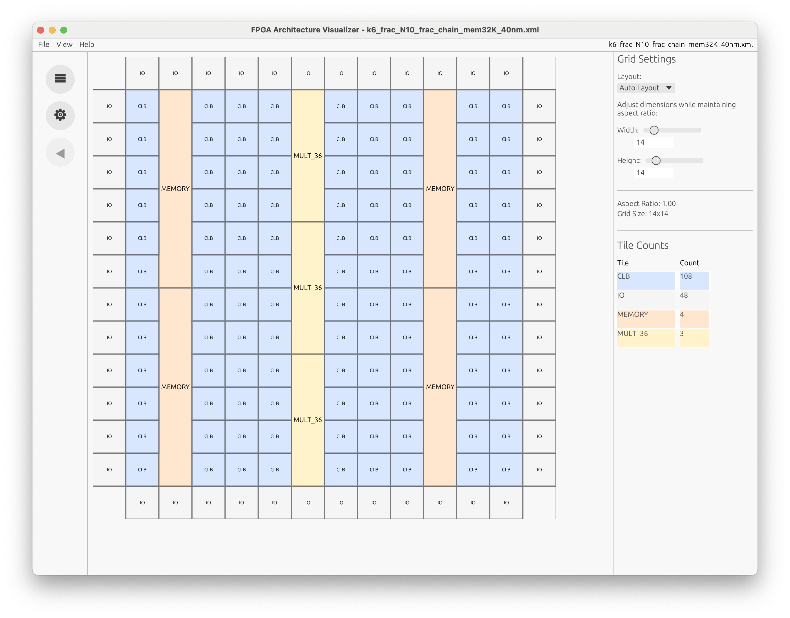
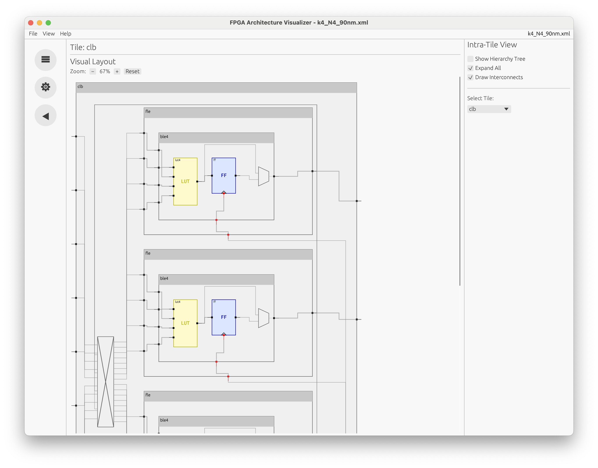
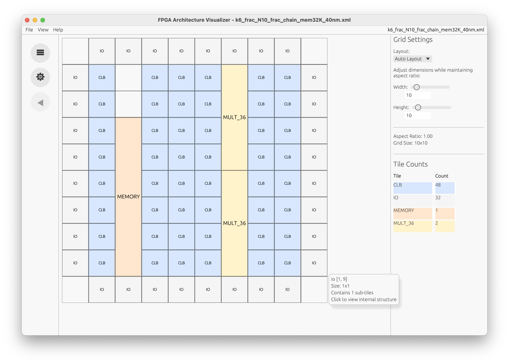
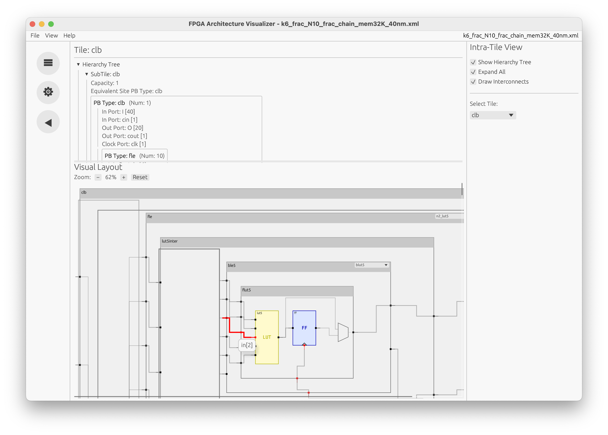

# FPGA Architecture Visualizer

[](LICENSE)
[](https://github.com/AlexandreSinger/rust-fpga-arch-visualizer/releases/latest)
[](https://github.com/AlexandreSinger/rust-fpga-arch-visualizer/actions/workflows/rust.yml)

A standalone, interactive visualizer for [VTR](https://verilogtorouting.org/) FPGA architecture description files. Parses your architecture XML, automatically detects errors, and lets you explore the full hierarchy — from the device tile grid down to primitive timing models — without running the VTR flow.

<p>


</p>

## Try Online

The visualizer is available as a **web application** that runs directly in your browser — no installation required:

**[Open in Browser](https://fpga-architecture-visualizer.web.app/)**

## Features

- **Device tile grid** — renders the FPGA fabric as a 2D grid with auto and fixed layout support, tile counts, and aspect ratio metrics.
- **Complex block hierarchy** — recursive block view with expand/collapse, per-mode selection, and an optional hierarchy tree panel.
- **Full interconnect visualization** — direct, mux, and complete interconnect rendered with hover highlighting and pin tooltips. Never previously visualized by VTR.
- **Primitive timing models** — visualizes timing arcs between primitives within a tile.
- **Error detection** — reports architecture description errors at parse time, before any CAD tool is run.
- **Orders-of-magnitude faster** than VTR's built-in graphics; no placement or routing run required.
- **Light/dark mode**, cross-platform desktop app (macOS, Linux, Windows).

## Installation

### Pre-Built Binaries (recommended)

**macOS and Linux:**
```sh
curl --proto '=https' --tlsv1.2 -LsSf https://github.com/AlexandreSinger/rust-fpga-arch-visualizer/releases/latest/download/fpga_arch_viewer-installer.sh | sh
```

**Windows (PowerShell):**
```powershell
powershell -ExecutionPolicy Bypass -c "irm https://github.com/AlexandreSinger/rust-fpga-arch-visualizer/releases/latest/download/fpga_arch_viewer-installer.ps1 | iex"
```

This installs `fpga_arch_viewer` (the application) and `fpga_arch_viewer-update` (auto-updater) to your PATH.

> **Note:** On macOS you may need to allow the app in System Settings → Privacy & Security the first time.

### Build From Source

Requires [Cargo](https://doc.rust-lang.org/cargo/getting-started/installation.html).

```sh
git clone https://github.com/AlexandreSinger/rust-fpga-arch-visualizer.git
cd rust-fpga-arch-visualizer
cargo build --release
./target/release/fpga_arch_viewer
```

## Usage

1. Launch `fpga_arch_viewer`.
2. Click **File → Open Architecture File** and select a VTR architecture XML file.
3. The **Summary view** opens, which gives an overall summary of the architecture; click **view tile grid** to see the **Device tile grid**. Hover over tiles for details; click a tile to drill into its **intra-tile view**.
4. In the intra-tile view, expand or collapse blocks, switch modes, and toggle interconnect overlays using the right-hand panel.





The **back arrow** in the left navigation bar returns to the previous view.

## Demos

- [Video walkthrough](https://youtu.be/ypVk95ZjI6Y) — slides and narrated overview
- [Feature demo](https://youtu.be/BIhsh-qbHR8) — major features in action
- [Slides](https://docs.google.com/presentation/d/1NXGFRixbnRxMU9UpB9kxxSlQUp7m2NCTHL0fqMGghno/edit?usp=sharing)

## Documentation

- [VTR Architecture Description Reference](https://docs.verilogtorouting.org/en/latest/arch/)
- [VPR Graphics Documentation](https://docs.verilogtorouting.org/en/latest/vpr/graphics/)

## Contributing

Contributions are welcome. Please open an issue to discuss significant changes before submitting a pull request.

## License

[MIT](LICENSE)
